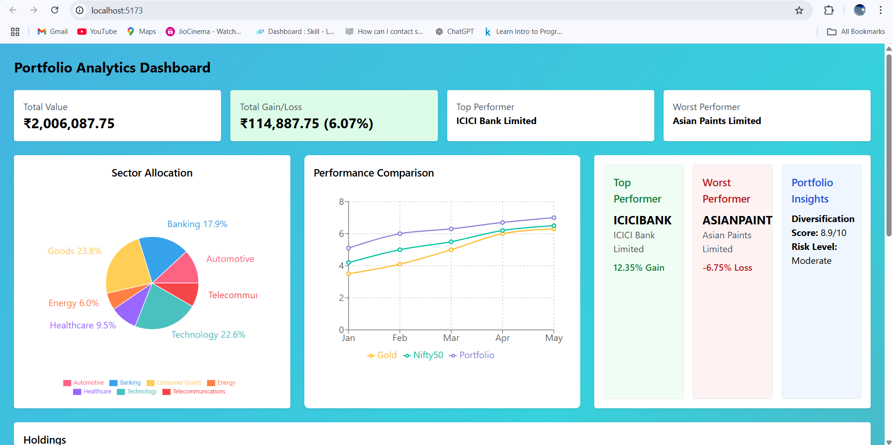
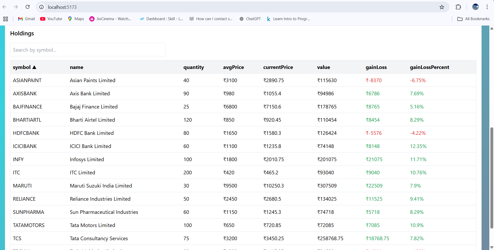
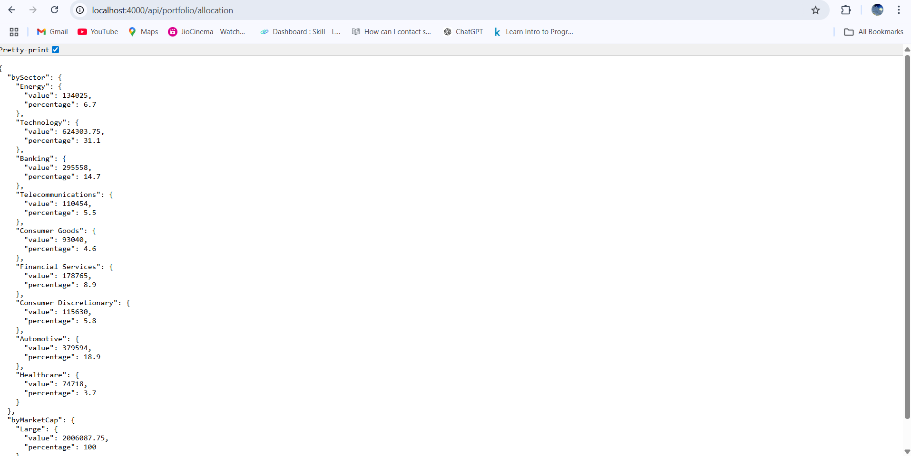

# WealthManager.online - Portfolio Analytics Dashboard

A full-stack fintech dashboard to visualize investment portfolio data using **React** (frontend) and **Node.js/Express** (backend).

---

## 📌 Overview
This dashboard allows users to visualize their investment portfolio with **sector allocation**, **market cap distribution**, **performance comparison**, and **top/worst performers**.  
The backend serves API endpoints from sample Indian stock data, while the frontend displays **interactive charts** built with Recharts.

---

## 🚀 Features
- **4 API endpoints**: holdings, allocation, performance, insights  
- **Interactive charts** with Recharts  
- **Responsive design** using Tailwind CSS  
- **Separation of frontend and backend** for flexibility  
- Uses sample Indian stock market data for realistic simulation  

---

## 🛠 Tech Stack
**Frontend:** React, Vite, Tailwind CSS, Recharts  
**Backend:** Node.js, Express  
**Data:** Sample JSON from provided Excel file  
**Version Control:** Git, GitHub  

---

## 📡 API Endpoints
| Endpoint           | Method | Description |
|--------------------|--------|-------------|
| `/api/holdings`    | GET    | Returns all portfolio holdings |
| `/api/allocation`  | GET    | Returns sector and market cap allocation |
| `/api/performance` | GET    | Returns monthly performance data |
| `/api/insights`    | GET    | Returns portfolio insights like diversification score and risk level |

---

## 📷 Screenshots

### Dashboard Overview



### Allocation Charts


---

## ⚙️ Running Locally

1️⃣ **Clone the repository**
```bash
git clone https://github.com/Durgarao3/WealthManager-Dashboard.git
cd backend && npm install && npm start
cd ../frontend && npm install && npm run dev
```
2. Backend runs at http://localhost:4000
3. Frontend runs at http://localhost:5173
